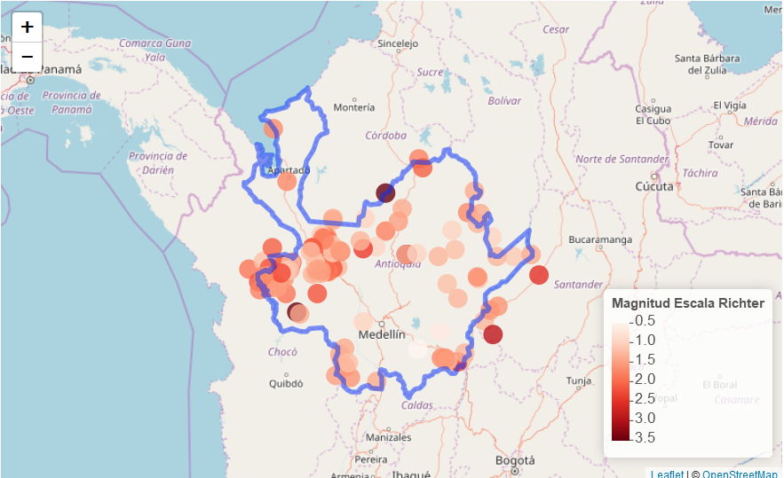
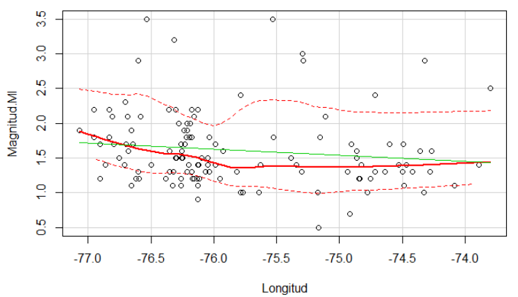
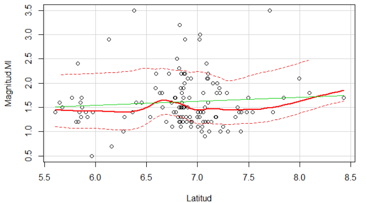
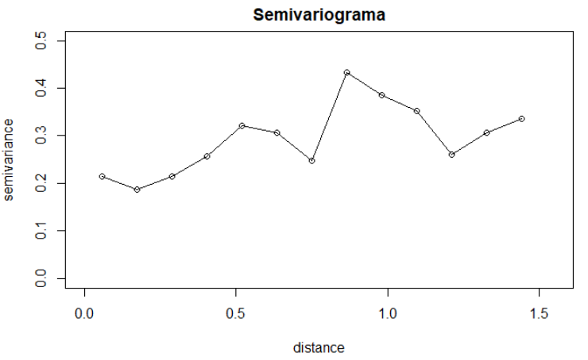
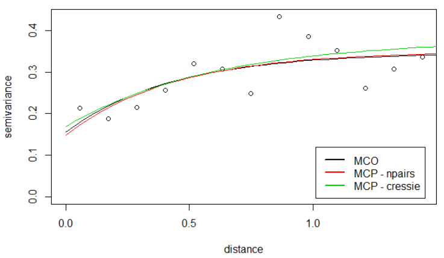
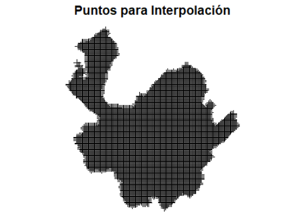

# Proyección de la magnitud de sismos para Antioquia
#### Febrero de 2018

## Autores:

- **Nestor Jardany Serrano Rojas**, [GitHub](https://github.com/jardanys/GeoEstadistica_Sismos)
- **Camilo Alejandro Aguilar Laverde**, [GitHub](https://github.com/CamiloAguilar/GeoEstadistica_Sismos)
- **Alvaro Enrique Villaba Mendez**, [GitHub](https://github.com/AlvaroVillalba/GeoEstadistica_Sismos)

<br><br>

## Introducción

El *objetivo* del presente estudio consiste en utilizar información histórica sobre la actividad sísmica en el departamento de Antioquia en Colombia, para  estimar por rangos, la posible intensidad actividad sísmica en las zonas donde no se presentaron movimientos.  

Para ello se aplicraron 3 diferentes métodos de análisis geoestadítico; **Kriging Universal**, **Kriging Ordinario** y **Inverso de la distancia**. El método que representó un mayor ajuste respecto a las mediciones utilizadas fué el Kriging Universal, puesto que el resultado respecto a la varianza no generan islas en el mapa y además resulta inferior frente a los demás métodos. En general, durante el presente trabajo se presenta la siguiente metodología:

- Se observaron descriptivamente los datos.
- Se comprueba estacionariedad.
- Se modela la dependencia espacial de la varianza por medio de un modelo exponencial.
- Se utiliza validación cruzada para determinar el mejor modelo de la varianza.
- Se realiza interpolación por tres métodos.

Las conclusiones del estudio son:

- La zona sur occidental de departamento es más propenso a tener actividad sismica con mayor nivel de magnitud y la zona sur oriental es la de menor actividad.
- Las zonas con mayor posibilidad sismita de acuerdo a la magnitud en la escala de Richter (actividad sismitca) se encuentran al occidente del departamento.
- La varianza no es muy alta y no presenta islas, la zona sur occidental de departamento es más propenso a tener actividad sismica con mayor nivel de magnitud y la zona sur oriental es la de menor actividad. La varianza no es muy alta mayor parte del territorio Antioqueño.

## Descripción de los datos

La información utilizada en el presente documento fue tomada de la [Red Sismológica Nacional de Colombia](http://200.119.88.135/RSNC/), en su _BOLETÍN PRELIMINAR DE EVENTO SÍSMICO_. Dichos datos contienen toda la actividad sísmica del departamento de Antioquia, durante el mes de Junio de 2017 y en total dicha información contiene 123 observaciones. 

El siguiente mapa espacial muestra la actividad sismica en el departamento de Antioquia. Se observa que la zona occidental presenta una mayor actividad frente a la zona centro, donde la actividad es casi nula. La magnitud más fuerte es de $3.5$ en la escala de Ricther, la cual se presentó en el municipio de *Taraza* el día 13 de junio, a una profundidad de $42.5$ Km.



<br><br>

## Análisis de Estacionariedad

Se realizan los gráficos de la variable *Magnitud en escala de Richter* contra las direcciones (Longitud, Latitud). Se observan con cierta estacionariedad y sin tendencia significativa. En los gráficos la media de la maginitud local se observa constante sobre la región de observación, por tanto no resulta necesario remover alguna dependencia.




A continuación se ajusta un modelo de la Magnitud Local en función de la Lat y Long. Se modela en términos de las direcciones y se utilizó un modelo cuadrático en las direcciones con un stepwise. Como se observa la magnitud no depende de las coordenadas y el proceso es estacionario.

```{r esta, echo=T, message=FALSE, warning=FALSE}
modelo1 = lm(Magnitud.Ml ~ Longitud + Latitud + I(Longitud * Latitud) + I(Longitud^2) 
             + I(Latitud^2), data = datosdf)
summary(modelo1)
```

## Análisis a sentimiento

La primer etapa en el desarrollo de un análisis geoestadístico, es la determinación de la dependencia espacial entre los datos medidos de una variable. Para esto hacemos uso del semivariograma sobre las magnitud de los sismos. Previo a su aplicación, es necesario convertir los datos a un objeto de clase __geodata__. Controlamos además la presencia de ubicaciones duplicadas.

```{r esta2.0, echo=T, message=FALSE, warning=FALSE}

datos2 <- data.frame(Longitud = datosdf$Longitud, Latitud = datosdf$Latitud, res = datosdf$Magnitud.Ml)
geo = as.geodata(datos2, coords.col = 1:2, data.col = 3)
class(geo)
dup.coords(geo)
```

Graficamos finalmente el variograma, donde se puede apreciar que existe una relación de dependencia espacial entre las diferentes observaciones.

```{r esta2.1, echo=T, message=FALSE, warning=FALSE}
var <- variog(geo, max.dist = 1.5, direction = "omnidirectional")
plot(var, main="Semivariograma", xlim=c(0, 1.55), type="o", ylim=c(0,0.5))
```



De acuerdo con lo anterior resulta necesario definir un modelo que describa dicha estructura de dependencia, lo que nos permitirá mas adelante realizar estimaciones en puntos donde no se presentaron aún sismos.

La siguiente gráfica muestra el contraste sobre el ajuste de los diferentes modelos anteriormente especificados conestructura exponencial:




## Validación Cruzada

La validación cruzada es una técnica utilizada para evaluar los resultados de un análisis estadístico. Aquí cada ubicación asociada a los sismos se elimina del conjunto de datos y la variable en esta ubicación se predice usando las ubicaciones restantes, utilizando cada modelo ajustado anteriormente. 

## Interpolación

Para el proceso de interpolación, se ha decidido tomar una muestra regular de **10,000** puntos dentro del poligono del departamento de antioquia, los cuales se observan a continuación:

```{r esta8, echo=F, message=FALSE, warning=FALSE}
plot(muestra, main="Puntos para Interpolación")
```




